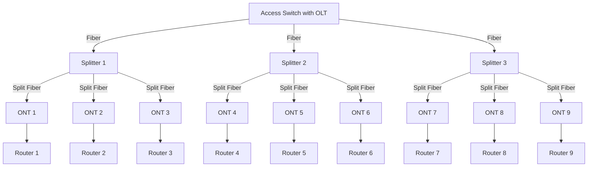

# Passive Optical Network (PON) Overview

A Passive Optical Network (PON) is a point-to-multipoint fiber access network that uses **unpowered optical splitters** to serve multiple customers over a single optical fiber from the provider's central office.

## PON Architecture Diagram

## PON Components

### OLT (Optical Line Terminal)

- Located at the service provider's pop locations
- Converts Ethernet traffic into optical signals and vice versa.
- Manages communication and timing with all ONTs in the network.
- Schedules upstream transmissions (e.g., via TDMA).
- Handles encryption, VLAN tagging, and Quality of Service (QoS).

### Optical Splitter

- A **passive** device placed in the field (e.g., pole, cabinet, pedestal).
- Splits a single fiber into multiple outputs without electrical power.
- Common split ratios: 1:4, 1:8, 1:16, 1:32.
- Introduces signal loss depending on the split ratio (more outputs = more loss).
- Enables cost-effective sharing of a single OLT port across many users.

### ONT (Optical Network Terminal)

- Located at the **customer premises**.
- Converts the incoming optical signal into Ethernet for use by the customer.
- Handles upstream communication back to the OLT.
- May include routing, Wi-Fi, VoIP ports (sometimes called ONU when integrated).
- Needs to be registered and authorized by the OLT before passing traffic.

| Component     | Location             | Role                                             |
|---------------|----------------------|--------------------------------------------------|
| **OLT**       | ISP Central Office   | Aggregates, converts traffic, manages ONTs       |
| **Splitter**  | Field (cabinet/pole) | Passively splits optical signals to multiple users |
| **ONT**       | Customer Premises    | Converts optical signal to Ethernet for user devices |

## GPON vs XGS-PON Comparison

Gigabit PON (GPON) and 10-Gigabit Symmetrical PON (XGS-PON) are both Passive Optical Network standards used for delivering fiber-based broadband. This section compares their technical characteristics, use cases, and compatibility.

### Comparison Table

| Feature               | **GPON**                        | **XGS-PON**                        |
|----------------------|----------------------------------|------------------------------------|
| Full Name            | Gigabit Passive Optical Network | 10-Gigabit Symmetrical PON         |
| Downstream Speed     | 2.488 Gbps                       | 10 Gbps                            |
| Upstream Speed       | 1.244 Gbps                       | 10 Gbps                            |
| Wavelength (Down)    | 1490 nm                          | 1577 nm                            |
| Wavelength (Up)      | 1310 nm                          | 1270 nm                            |
| Split Ratio          | Up to 1:128                      | Up to 1:128                        |
| Symmetric Speeds     | ❌ No                            | ✅ Yes                              |
| Coexistence          | ✅ Coexists with XGS-PON         | ✅ Coexists with GPON              |
| Typical Use Cases    | Residential broadband            | Enterprise, 4K/8K video, future-proof FTTH |

### Wavelength Overview

- **GPON** uses:
  - Downstream: **1490 nm**
  - Upstream: **1310 nm**

- **XGS-PON** uses:
  - Downstream: **1577 nm**
  - Upstream: **1270 nm**

These wavelength differences allow both technologies to coexist on the same fiber infrastructure using **Wavelength Division Multiplexing (WDM)**.

### Summary

- **GPON** is widely deployed for standard residential services.
- **XGS-PON** delivers symmetrical 10 Gbps speeds, making it ideal for business users, cloud workloads, and next-gen residential services.

### Can You Use an XGS-PON ONT on a GPON OLT?

No — you **cannot** use an **XGS-PON ONT** on a **GPON OLT**.

#### Why It Doesn't Work

- **Protocol mismatch**: GPON OLTs do not support XGS-PON signaling or framing.
- **Wavelength mismatch**: XGS-PON upstream/downstream wavelengths are different.
- **Management incompatibility**: GPON OLTs cannot register or provision XGS-PON ONTs.

Even though they share similar physical media (fiber, splitters), the technologies are not backward-compatible.

| Scenario                               | Works? | Notes                                      |
|----------------------------------------|--------|--------------------------------------------|
| XGS-PON ONT on GPON OLT                | ❌     | Incompatible protocols                     |
| GPON ONT on XGS-PON OLT (non-combo)    | ❌     | Incompatible unless it's a combo OLT       |
| GPON & XGS-PON coexist on same fiber   | ✅     | Requires proper wavelength filtering       |
| Combo OLT with both GPON & XGS-PON     | ✅     | Ideal for gradual migration and coexistence |

## ONT Registration on the OLT

Before an ONT can be used in the network, it must be authenticated and provisioned by the OLT.

### Registration Process:
1. **Discovery**: ONT sends a registration request upstream.
2. **Authentication**: OLT verifies the ONT using its serial number or PLOAM password.
3. **Provisioning**: Bandwidth profiles, VLANs, and services are assigned.
4. **Authorization**: Once provisioned, the ONT is allowed to communicate on the network.

> This ensures only **authorized ONTs** can access the PON, and allows the ISP to enforce bandwidth, QoS, and security policies per subscriber.

## Using Your Own ONT or PON SFP Module

!!! warning
    Using your own ONT or PON SFP module comes with certain risks and challenges. It’s recommended only for users who are knowledgeable about the technology and do not rely heavily on their internet connection, as issues may arise that you’ll need to troubleshoot on your own — without help or support from your ISP.

Some fiber internet users prefer to use their **own ONT** (Optical Network Terminal) or **PON SFP module** in a router, instead of relying on the ISP-provided ONT. While this can offer more flexibility, it comes with important trade-offs.

#### What Is a PON SFP?

A **PON SFP** is a small form-factor pluggable module (e.g., GPON or XGS-PON) that fits into a compatible router or switch with an SFP port. It essentially replaces a standalone ONT by handling the optical connection directly.

#### Advantages of Using Your Own ONT or SFP

| Advantage                         | Description |
|----------------------------------|-------------|
| **Hardware Integration**         | Use a single router/firewall (like MikroTik, Ubiquiti, pfSense) instead of separate ONT + router. |
| **Lower Power Usage**            | No separate ONT device drawing power. |
| **Advanced Networking Features** | Full control over VLANs, PPPoE, DHCP, bridge modes, etc. |
| **Better Placement**             | No double NAT or cable clutter if ONT is built into your main router. |
| **Flexibility**                  | Easier to change equipment, upgrade to better optics, or use open-source systems. |

#### Disadvantages and Limitations

| Disadvantage                      | Description |
|----------------------------------|-------------|
| **ISP Restrictions**             | Many ISPs do not allow third-party ONTs. |
| **Registration Required**        | ONTs must be registered with the ISP (via serial number or PLOAM password). |
| **Lack of Support**              | If you use your own ONT, the ISP may refuse to help with connection issues. |
| **Compatibility Issues**         | Not all SFP modules are compatible with all routers or ISPs. |
| **Firmware/Feature Gaps**        | Some advanced OLT features may not work with third-party ONTs. |

#### Considerations Before Switching

- **Check with your ISP**: Some allow self-provisioned ONTs or provide a whitelist.
- **Know your PON type**: GPON and XGS-PON use different wavelengths and speeds.
- **Get the right module**: Popular brands include Nokia, FS, Zaram and Huawei.

Using your own ONT or PON SFP can simplify your network, reduce latency, and offer better control. However, getting it working may require technical know-how and ISP cooperation.

**✔ Best for:** Power users, homelabbers, and network pros.  
**✖ Avoid if:** You rely on ISP support.

