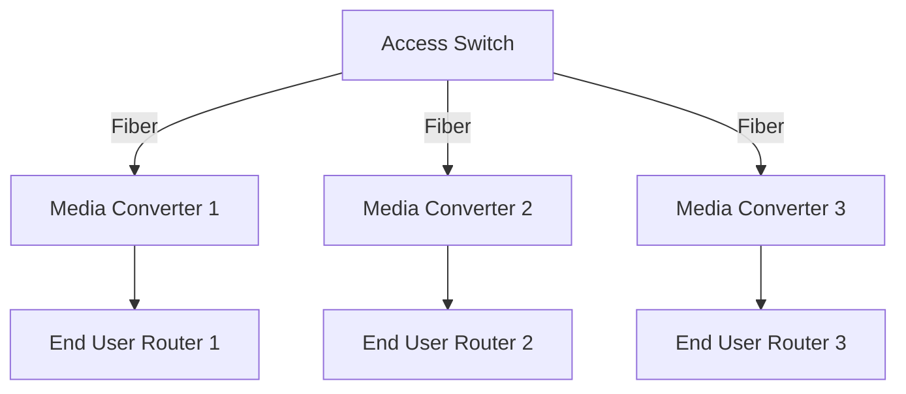

# Point-to-Point (PtP) Fiber Overview

Point-to-Point (PtP) fiber architecture provides a **dedicated fiber optic line** from the provider's central office or access switch to each end user. This is a simple, high-performance model ideal for businesses or premium residential setups.

## PtP Architecture Diagram

## PtP Components

### Access Switch

- Located at the provider’s pop locations.
- Sends dedicated fiber connections to each customer.
- Requires a switch port for every user.

### Media Converter

- Installed close to the end user to convert fiber to Ethernet.
- May be powered and require indoor or CPE placement.
- Passes the Ethernet signal to the router.

### End-User Router

- Located at the customer’s premises.
- Distributes the Ethernet connection via Wi-Fi or LAN ports.
- May be managed or customer-owned depending on the ISP.

| Component         | Location              | Role                                               |
|------------------|------------------------|----------------------------------------------------|
| **Access Switch**| ISP Network/Central Office | Direct connection point for each user            |
| **Media Converter** | Near Customer Premises | Converts optical signal to Ethernet               |
| **End-User Router** | Customer Premises       | Interfaces with user devices (Wi-Fi, Ethernet, etc.) |

## Using Your Own Media Converter or SFP

Advanced users may choose to use their own **media converter** or **SFP module** in a router or switch instead of the ISP-provided equipment.

### Advantages

- Full control over routing, firewall, and VLANs
- Reduced clutter by eliminating extra powered devices
- Compatibility with enterprise gear (e.g., MikroTik, Ubiquiti, pfSense)

### Considerations

- Your device must support the correct fiber type and wavelength
- The SFP must be compatible with the switch or router you install it in
- Ethernet settings like auto-negotiation and link speed must match the ISP switch

Using your own equipment for PtP fiber is more feasible than with PON setups, since PtP relies on standard Ethernet optics. However, you should still confirm compatibility with your ISP's infrastructure to avoid link issues or unsupported configurations.