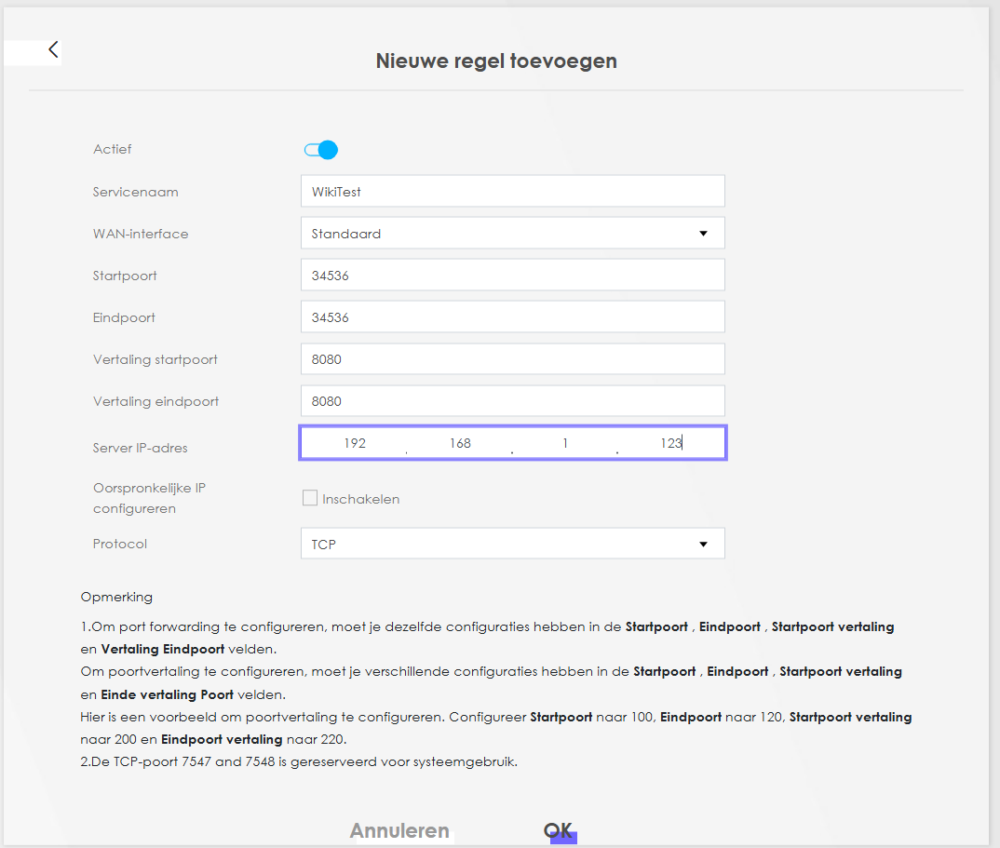

# How to Setup Port forwarding

Port forwarding is a networking technique that allows external devices to access services on a private network. It works by telling your router to redirect incoming traffic on a specific port (like port 8080) to a specific device and port inside your local network. This is commonly used for hosting web servers, remote desktop access, or game servers from behind a router or firewall.

## Security
While port forwarding is super useful, it does come with some risks. When you open a port to the internet, you're basically exposing part of your home network to the outside world. If the device or service you're forwarding to isn't secure, it could be an easy target for hackers or bots scanning for open ports. That’s why it’s important to only forward what you really need, use strong passwords, keep devices updated.

!!! tip
    Instead of opening ports on your modem or router, there are more secure options for accessing resources at home. Services like **[Cloudflare Tunnel](https://www.cloudflare.com/products/argo-tunnel/)** and **[Tailscale](https://tailscale.com/)** (a VPN) let you securely connect to your devices without the risks of exposing ports. These tools create a safe, encrypted connection, making it much harder for unwanted visitors to get in while still giving you remote access to everything you need.

## Configure

!!! info
    This guide applies to all Odido modems.

Follow these steps to configure port forwarding on your Odido modem:

1. Log in to the Web UI.
2. In the top-right corner, click the "hamburger" menu (three horizontal lines).
3. Navigate to **Network Settings** > **NAT**.
4. In the **Port Forwarding** tab, click **Add New Rule**.
5. Fill in the required fields:
    - Toggle **Active** to enable the rule.
    - Enter a **Service name** (this can be any name you choose).
    - For **WAN Interface**, leave it set to **Default**.
    - **Start Port**: Enter the first port number for the external connection.
    - **End Port**: Enter the last port number for the external connection.
    - **Translation Start Port**: Enter the first port number for the internal LAN connection.
    - **Translation End Port**: Enter the last port number for the internal LAN connection.
    - **Server IP Address**: Enter the IP address of the device to forward traffic to.
    - **Protocol**: Select the protocol—TCP, UDP, or both—depending on the service you are forwarding.

## Type of forwards
When setting up port forwarding, there are three common types of forwarding: Same Destination and Source Port, Different Destination and Source Port, and Same Destination and Source Port Range. Each method serves different needs depending on how you want to direct external traffic to your internal network.

### Same Destination and Source Port
In this setup, both the external (internet) and internal (local network) ports are the same. This is useful when you want to forward traffic from a specific public port directly to the same port on a local server.

### Diffrent Destination and Source Port
In this setup, the external (internet) port is different from the internal (local network) port. This allows you to map one external port to a different internal port, which can be useful for services that require specific internal configurations or if you're running multiple services on the same public port.

### Same Destination and Source Port Range
In this setup, the external ports form a range and map to the same internal port range on your local server. This is useful when you need to forward a block of ports (e.g., for applications that require multiple ports) while keeping the port mapping consistent between external and internal connections.

